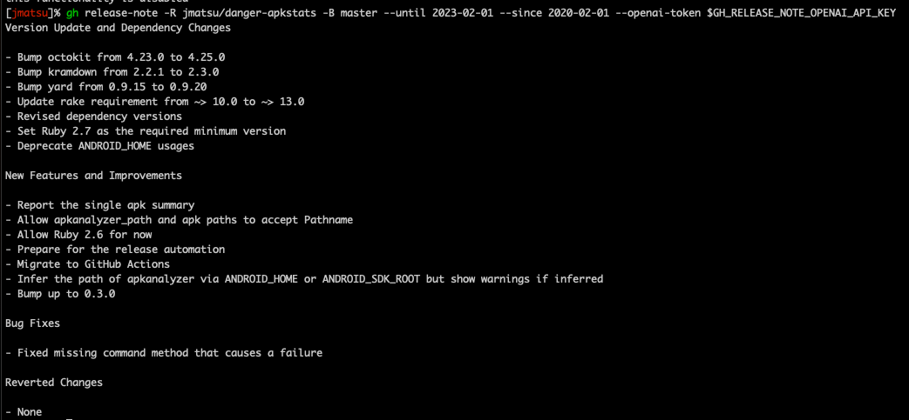

# gh release-note

A gh extension to generate release notes from pull requests merged between two dates.



# THIS COMMAND IS STILL WIP

TODOs

- [x] Generate the release note from the pull request information.
- [ ] Generate the pull request summary for each pull request. (You may have to specify one pull request.)
- Improvements
    - [ ] Improve and add new built-in prompts to generate better release notes.
    - [ ] Extract and use additional information from descriptions and/or commit messages for the release note.

# Usage

```
NAME:
   gh release-note - Generate release notes from pull requests.

USAGE:
   gh release-note [global options] command [command options] [arguments...]

COMMANDS:
   help, h  Shows a list of commands or help for one command

GLOBAL OPTIONS:
   --repo value, -R value  Select another repository using the [HOST/]OWNER/REPO format
   --base value, -B value  Select a base branch name
   --limit value           Select a limit to get pull requests and/or tags at once (default: 100)
   --skip-generate         Specify if you would like not to generate the release note but want pull requests (default: false)
   --since value           Select a date for the start position of the search range using YYYY-MM-dd[ HH:mm:SSZ]
   --since-tag value       Select a tag name for the start position of the search range
   --until value           Select a date for the end position of the search range using YYYY-MM-dd[THH:mm:SSZ]
   --until-tag value       Select a tag name for the end position of the search range
   --openai-token value    Specify your OpenAI token
   --prompt value          Provide your custom prompt
   --prompt-style value    Select a name of built-in prompts. This will be ignored if --prompt is provided (default: "simple")
   --help, -h              show help
```

## Get the list of the pull requests merged into main from 2023/04/03 to 2023/06/09

```bash
gh release-note --base main --since 2023-04-03 --until 2023-06-09 --skip-generate
```

## Generate the release note from the list of the pull requests merged into main  from 2023/04/03 to 2023/06/09

```bash
gh release-note --base main --since 2023-04-03 --until 2023-06-09 --openai-token <your token>
```
